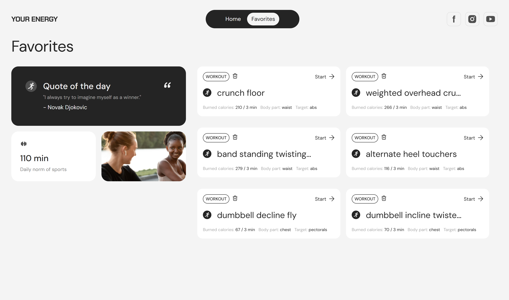

# 🏋️ Your Energy

Welcome to **Your Energy**, a project designed to help users explore exercises, filter them by categories, and maintain motivation for a healthier lifestyle.  

---

## 🌟 Features

- **Header**: Responsive navigation bar with links to social media and burger menu.
- **Home Page**:
  - Hero section with site title, popular tags, and image.
  - Filter panel to search exercises by categories.
  - Category and exercise lists.
  - Daily fitness quotes fetched from the backend and stored locally.
  - Server-side pagination for efficient data handling.
- **Favorites Page**: Display saved exercises and daily fitness quote.
- **Exercise Details Modal**:
  - Video demonstration, calorie burn estimate, and exercise details.
  - Add/remove exercise from favorites.

#### **Additional Features:**

- Rating system for exercises with email validation.
- Newsletter subscription with email form validation.
- Animated loader (spinner) for asynchronous requests.
- Scroll-to-top button.

---

## 🛠️ Tech Stack

### **Languages and Tools**:

- **Frontend:** JavaScript, HTML, CSS
- **Icons & SVGs:** Custom SVG icons for social media links and UI elements
- **Package Manager:** NPM

---

## 🖼️ Key Pages and Screenshots

### Homepage
Includes filters, motivational quotes, and categories of exercises.

### Favorites Page
Displays a list of saved exercises added by the user.

---

## 🤝 Collaboration

This project was developed as a team effort. Special thanks to all contributors! 🙌

### Team Members:
-  Valeria **Team Lead**
-  Vasyl **Scrum Master**
-  Vladyslav **Front End Developer**
-  Oleksii **Front End Developer**
-  Sergey **Front End Developer**
-  Oleksandr **Front End Developer**
-  Roman **Front End Developer**
-  Andrii **Front End Developer**
-  Oksana **Front End Developer**
-  Yuri **Front End Developer**

---

## 🔗 Live Demo

Check out the live version here: [Your Energy Live](https://valeriabokotejova.github.io/your-energy/)

---

## 📜 License
This project is licensed under the MIT License. See the [LICENSE](./LICENSE) file for details.

> Built with ❤️ by ***Energy Drive***
